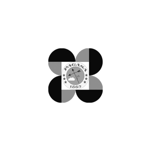

# Typhoon Sensor for Home Assistant

## Overview
The **Typhoon Sensor** is a custom Home Assistant integration that provides real-time tracking of tropical cyclones in the Philippines. It scrapes the [PAGASA Severe Weather Bulletin](https://www.pagasa.dost.gov.ph/tropical-cyclone/severe-weather-bulletin) to give you critical data such as the typhoon's distance from your home, wind strength, movement, and track images.

This integration is perfect for automating home preparations (e.g., charging batteries, notifying family) based on the proximity and severity of a typhoon.

## Features
- **Real-time Data**: Fetches the latest bulletin directly from PAGASA.
- **Smart Polling**: Automatically schedules updates based on the next advisory time to optimize resources.
- **Distance Calculation**: Calculates the distance (km) of the typhoon's eye from your home.
- **Rich Sensor Data**:
  - **Name & Classification**: e.g., "Kristine" (Severe Tropical Storm).
  - **Location**: Lat/Lon coordinates and specific location details.
  - **Wind Strength**: Max sustained winds and gustiness (km/h).
  - **Movement**: Direction and speed (e.g., "West Northwestward at 15 km/h").
  - **Visuals**: Accurate track image from PAGASA.
  - **Timestamps**: Advisory issuance time and next scheduled advisory.
- **Manual Control**: Includes a button to force a data refresh.

## Installation

### Method 1: HACS (Recommended)
We have yet to submit this module to the HACS repository. In the meantime, you can install it manually or use the custom repositories feature of HACS.

1. Ensure [HACS](https://hacs.xyz/) is installed.
2. Go to **HACS > Integrations**.
3. Click the menu (three dots) > **Custom repositories**.
4. Add the URL of this repository and select **Integration** as the category.
5. Click **Add**.
6. Search for "Typhoon Sensor" and click **Download**.
7. Restart Home Assistant.

### Method 2: Manual Installation
1. Download the `typhoon_sensor` folder from this repository.
2. Copy it to your Home Assistant's `config/custom_components/` directory.
3. Restart Home Assistant.

## Configuration
1. Go to **Settings > Devices & Services**.
2. Click **Add Integration** and search for **Typhoon Sensor**.
3. Enter the following details:
   - **Latitude & Longitude**: Your home coordinates (defaults to your HA zone).
   - **Scan Interval**: How often to check for updates (default: 30 minutes).
   - **Enable Smart Polling**: Check this (recommended) to automatically schedule updates based on the "Next Advisory" time in the bulletin, reducing unnecessary web traffic.

## Entities
The integration creates a device named **Typhoon Sensor** with the following entities:

| Entity ID | Name | Description |
| :--- | :--- | :--- |
| `sensor.typhoon_name` | Typhoon Name | Name of the active typhoon. |
| `sensor.typhoon_classification` | Classification | e.g., Tropical Depression, Typhoon. |
| `sensor.typhoon_distance` | Typhoon Distance | Distance from your home in km. |
| `sensor.typhoon_image` | Typhoon Image | Track image URL. |
| `sensor.typhoon_movement` | Typhoon Movement | Direction and speed. |
| `sensor.typhoon_maximum_sustained_winds` | Max Sustained Winds | Wind speed in km/h. |
| `sensor.typhoon_gustiness` | Gustiness | Gust speed in km/h. |
| `sensor.typhoon_advisory_time` | Advisory Time | When the bulletin was issued. |
| `sensor.typhoon_next_advisory_time` | Next Advisory Time | When the next bulletin is expected. |
| `button.typhoon_manual_refresh` | Manual Refresh | Press to force an immediate update. |

## Dependencies
This integration automatically installs:
- `beautifulsoup4` (for parsing HTML)
- `haversine` (for distance calculation)

## License
MIT License